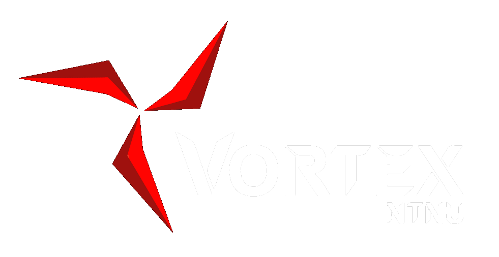

# Nautilus AUV PCB Repo

  

---

## Overview

This is where all the project files for Nautilus PCBs are stored.

---

## Boards

| Project | Board | Description | Status |
|---------|-------|-------------|--------|
| [Acoustics](Acoustics) | [Filters](Acoustics/acoustics-filters) | Acoustics you know | In development |
| Adapters | [Peripheral Board](peripheral-adapter) | Adds peripherals to SBC | In development |
| Adapters | [CAN Adapter](can-adapter) | M.2 CAN adapter for SBC | In development |
| Power | [Switch Supply](switch-psu) | 12V supply for ethernet switch | In development |
| Power | [24V Supply](24V-psu) | 24V supply for sonar and SBC | In development |
| Power | [Power Distribution Board](pdb) | Board for distributing power | In development |

Each board folder contains its own README with schematics, BOM, and fabrication files.

## Libraries

We for the most part use Würth's github library since we mostly use Würth's components in our PCBs.
To ensure you have this when cloning ask chat or google how to use the github package.
The Würth library does not contain WR-TBL (aka terminal blocks). To get these you must download it from Würth manually and then move the files into the correct Würth library folders.
The rest of our component libraries are either self made or downloaded via the impartGUI plugin.

## License

Hardware licensed under [CERN-OHL-P v2](https://ohwr.org/cern_ohl_p_v2.txt). Software licensed under [MIT](LICENSE).
